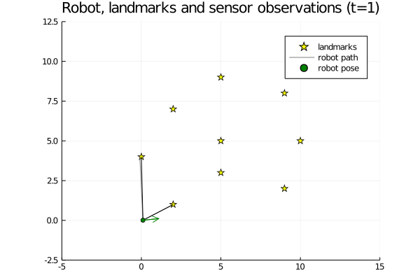
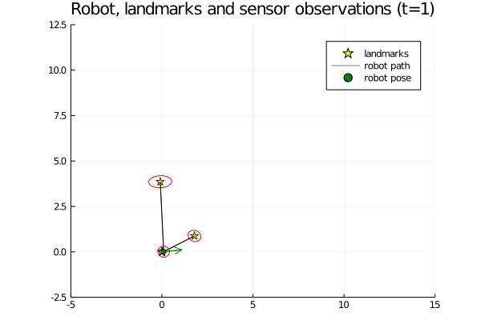
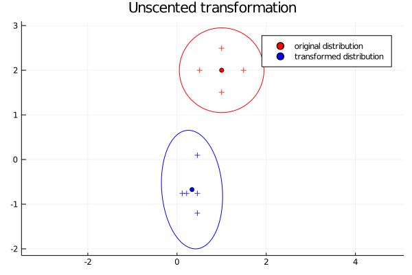

This repository contains the solutions of some exercises from the lecture [Robot Mapping](http://ais.informatik.uni-freiburg.de/teaching/ws13/mapping/) by:

- Lecturer: Cyrill Stachniss
- Tutors: Rainer Kuemmerle and Fabrizio Nenci

I've rewritten all examples in the [Julia](https://julialang.org) language.

Lecture recordings are available on [YouTube](https://www.youtube.com/playlist?list=PLgnQpQtFTOGQrZ4O5QzbIHgl3b1JHimN_).

## Exercise "odometry model" (sheet 1, exercise 2)

## Exercise "EFK SLAM" (sheet 4, exercise 1)

## Exercise "Unscented transform" (sheet 5, exercise 1)

## Exercise "Unscented SLAM" (sheet 6, exercise 1)

## Related

- Repositories containing solutions written in Octave:
    - https://github.com/kiran-mohan/SLAM-Algorithms-Octave
    - https://github.com/salihmarangoz/RobotMappingCourse
    - https://github.com/aimas-upb/slam-course-solutions
